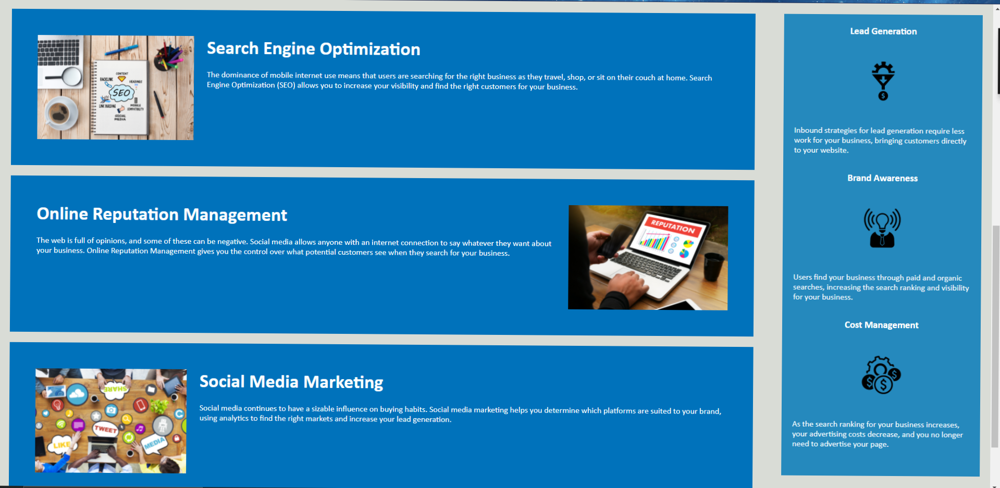
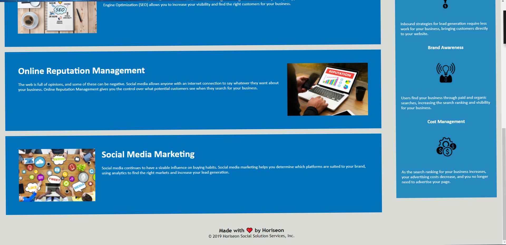

# Project Title: 
Accessability_Improvment

# Description: 
The client has already created an html and css file for their Horiseon website. The code was properly taged, id'd and consolidated for future developers to better navigate with future iterations. All links were properly edited so that when clicked by the user it functions properly. With these criteria met, the website will be more user-friendly for everyone.

## Photos of the Website:

# URL of the deployed application: 
https://leelai064.github.io/Accessability_Improvement/

# URL of the Github repo: 
https://github.com/Leelai064/Accessability_Improvement.git
